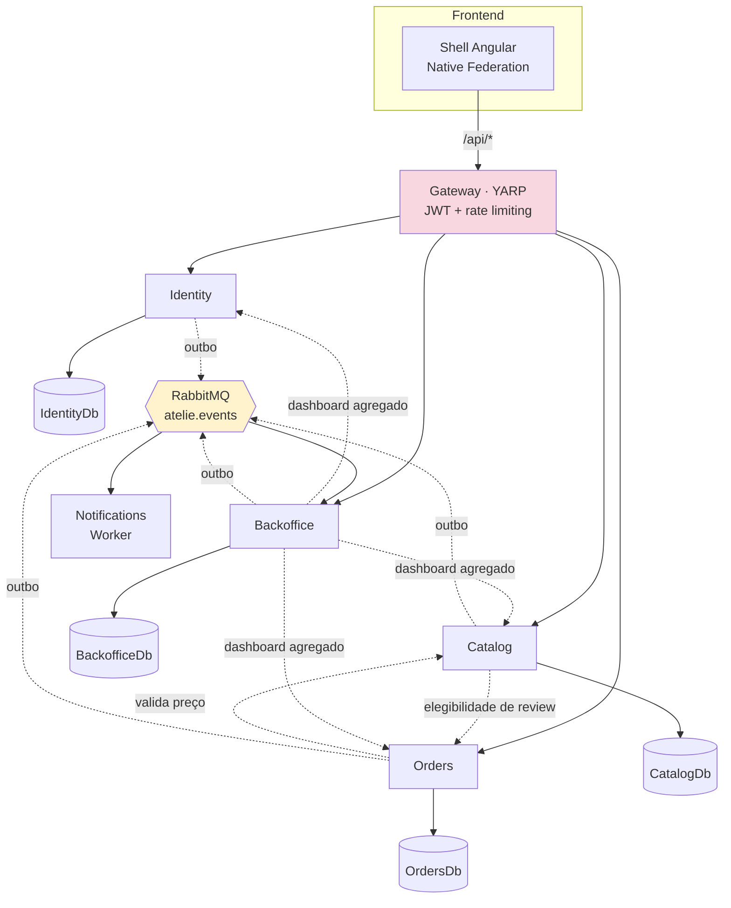
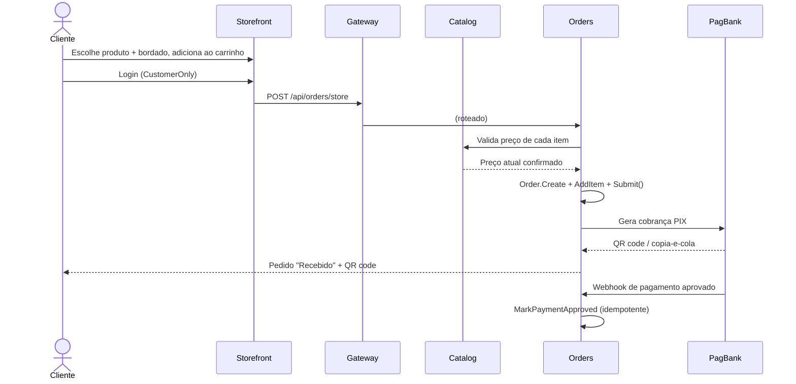
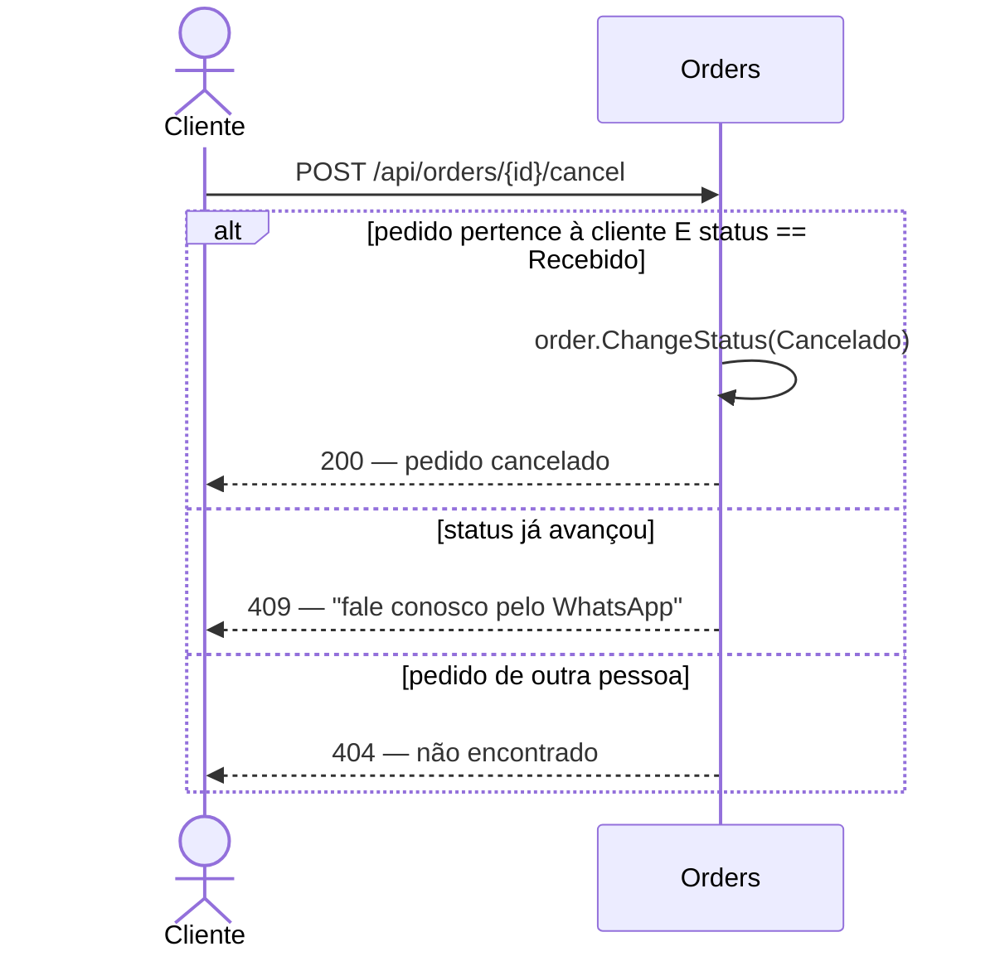
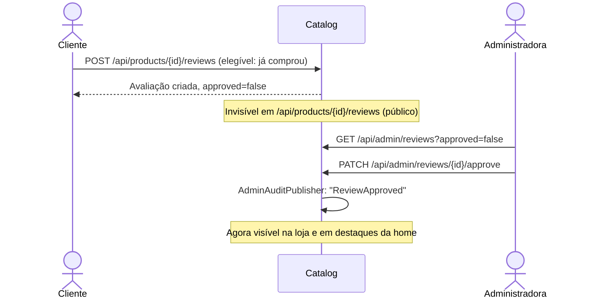
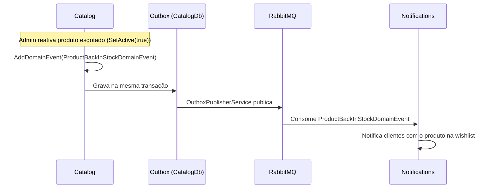
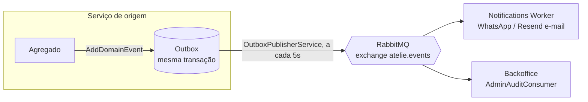
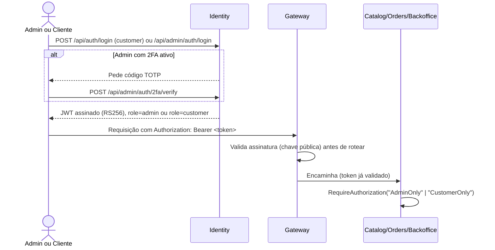

# Ateliê Layette Baby — arquitetura de microsserviços

Esta é a arquitetura em produção: **`layettebaby.com.br` roda inteiramente sobre o que está
documentado aqui** desde a migração de 2026-09-08 (ver "Status" no fim deste documento). Este
repositório foi extraído em 2026-09-10 do antigo monorepo
[`pauloffalves1/atelie-bebe`](https://github.com/pauloffalves1/atelie-bebe) (que agora contém só o
monólito `server/`/`client/`, mantido parado por algumas semanas como rollback, sem receber mais
mudanças) — todo o histórico de commits que tocou a pasta `microservices/` de lá foi preservado
aqui, na raiz deste repositório. Qualquer trabalho novo entra aqui.

Este documento segue um estilo inspirado em Spec-Driven Development: além de arquitetura e "como
rodar", cobre a visão de negócio, como o domínio foi descoberto (domain storytelling/event
storming), os requisitos funcionais/não funcionais atuais, autenticação/autorização, e a estratégia
de testes (unitários, TDD, BDD, UI/e2e e carga) — com os projetos de teste reais linkados de cada
subseção, não apenas descritos em prosa.

## Sumário

- [Visão de negócio](#visão-de-negócio)
- [Arquitetura](#arquitetura)
- [Domain Storytelling](#domain-storytelling)
- [Event Storming](#event-storming)
- [Requisitos](#requisitos)
- [Autenticação e Autorização](#autenticação-e-autorização)
- [Estratégia de testes](#estratégia-de-testes)
- [Rodando localmente com `dotnet run` (sem Docker)](#rodando-localmente-com-dotnet-run-sem-docker)
- [Rodando com Docker Compose](#rodando-com-docker-compose)
- [Rodando no Kubernetes (Docker Desktop)](#rodando-no-kubernetes-docker-desktop)
- [CI](#ci)
- [Fora do escopo (deliberado)](#fora-do-escopo-deliberado)
- [Status](#status)

## Visão de negócio

O Ateliê Layette Baby é especializado exclusivamente em **fraldas de ombro e boca bordadas** para
bebês — não é uma loja de enxoval genérica. As únicas categorias de produto são "Kit Ombro e Boca",
"Fralda de Ombro" e "Fralda de Boca" (reforçado em código: `Catalog`'s `DbInitializer` remove no
startup qualquer produto seedado fora dessas categorias). Toda peça pode ser personalizada com um
bordado (texto + cor da linha), escolhido pelo cliente na própria página do produto antes de
adicionar ao carrinho.

Duas personas usam o sistema:

- **Cliente final** — navega a loja sem precisar de conta, monta o carrinho com personalização por
  item, faz login apenas para finalizar a compra (checkout exige `CustomerOnly`), acompanha pedidos
  em "Minha conta", pode cancelar um pedido enquanto ele não entrou em produção, avalia produtos que
  comprou, e pode favoritar peças (`/favoritos`) ou ser convidada a comprar de novo quando um item
  favoritado volta ao estoque.
- **Administradora do ateliê** — dona do negócio, pode cadastrar outras administradoras (funcionárias,
  por exemplo) e escolher exatamente quais áreas cada uma acessa — ver "Permissões granulares por
  administradora" abaixo. Gerencia catálogo, promoções, cupons, pedidos (mudança de status, código de
  rastreio), moderação de avaliações, mensagens de contato, newsletter, imagens do site/galeria, e
  acompanha um dashboard agregado com auditoria de ações administrativas. Cada administradora protege
  a própria conta com 2FA opcional (TOTP) e pode trocar sua própria senha a qualquer momento.

## Arquitetura

| Serviço | Dono de | Porta interna |
|---|---|---|
| `identity` | Admin (+2FA), Customer (auth, CPF, verificação de e-mail, endereço) — assina os JWTs (RS256) | 8080 |
| `catalog` | Product, GalleryImage, SiteImage, ProductReview, WishlistItem, upload de arquivos, previews de SEO para bots | 8080 |
| `orders` | Order, Coupon, CartSnapshot (+lembrete de carrinho abandonado), pagamento (PagBank) | 8080 |
| `backoffice` | ContactMessage, NewsletterSubscriber, AuditLog, Dashboard (agregação), Sitemap | 8080 |
| `notifications` | Worker — consome eventos do RabbitMQ, envia WhatsApp/e-mail | 8080 (só health) |
| `gateway` | YARP — único ponto de entrada HTTP, roteia por prefixo de path, rate limiting, valida JWT | 8080 |

`shared/AtelieBebe.SharedKernel`: `Entity`/`ValueObject`/exceções, infraestrutura do outbox
transacional, cliente RabbitMQ (publish/subscribe), autenticação JWT compartilhada (RS256),
`AdminAuditPublisher` (publica um evento de auditoria a cada ação administrativa relevante).



Cada serviço grava seus próprios eventos de domínio na própria tabela outbox (mesma transação da
mudança de estado) e um `OutboxPublisherService` os publica no RabbitMQ (exchange `atelie.events`,
routing key = nome do evento). `Notifications` (WhatsApp/e-mail) e `Backoffice` (auditoria via
`AdminAuditConsumer`) consomem o que interessa a cada um. Chamadas síncronas entre serviços existem
só onde é inevitável (Orders→Catalog para validar preço, Catalog→Orders para elegibilidade de
review, Backoffice→Identity/Catalog/Orders para o dashboard) — o resto é resolvido no frontend,
chamando o Gateway por serviço.

O frontend é um microfrontend Angular (Native Federation): `shell` é o host servido em `/`, que
carrega `storefront` (loja pública) e `admin` (painel administrativo) como remotes em runtime —
cada um é um projeto Angular independente, testável e deployável isoladamente.

## Domain Storytelling

Quatro histórias cobrindo os fluxos que mais concentram regras de negócio — ator → atividade →
objeto de trabalho, na notação de domain storytelling.

### 1. Cliente compra uma peça personalizada

**Cliente** navega a **Loja** → abre um **Produto** → escolhe texto e cor do bordado → adiciona ao
**Carrinho** → faz login (ou cria conta) → confirma o **Pedido** no Checkout → paga via **PIX** →
recebe a confirmação.



### 2. Cliente cancela um pedido antes da produção começar

**Cliente** acessa **Minha conta** → escolhe um pedido com status "Recebido" → cancela. O sistema
recusa se a produção já começou, orientando a falar pelo WhatsApp.



Coberto ponta a ponta pelo BDD em
[`AtelieBebe.Orders.Core.Tests/Features/CancelamentoDePedido.feature`](services/orders/AtelieBebe.Orders.Core.Tests/Features/CancelamentoDePedido.feature).

### 3. Administradora modera uma avaliação

**Cliente** que comprou um produto envia uma **Avaliação** (nota + comentário + foto opcional) →
avaliação nasce pendente, invisível na loja → **Administradora** aprova ou rejeita no painel → só
avaliações aprovadas aparecem na página do produto e na home.



### 4. Sistema convida a cliente a comprar de novo (eventos de domínio)

Sem nenhuma ação manual: um produto favoritado volta ao estoque, ou um carrinho fica montado sem
finalizar por tempo demais — o próprio agregado levanta o evento, o outbox garante que ele não se
perde, e o worker de notificações decide o que fazer.



## Event Storming

Todos os eventos de domínio reais do código — cada um nasce dentro de um agregado (nunca é
"levantado" por um serviço de aplicação diretamente) e é persistido no outbox na mesma transação da
mudança de estado.

| Evento | Agregado / serviço | Disparado por | Consumido por |
|---|---|---|---|
| `CustomerRegisteredDomainEvent` | `Customer` (Identity) | `Customer.Register()` | Notifications (e-mail de boas-vindas) |
| `EmailVerificationRequestedDomainEvent` | `Customer` (Identity) | `Customer.RequestEmailVerification()` | Notifications (e-mail com link) |
| `PasswordResetRequestedDomainEvent` | `Customer` (Identity) | `Customer.RequestPasswordReset()` | Notifications (e-mail com link) |
| `ProductBackInStockDomainEvent` | `Product` (Catalog) | `Product.SetActive(true)`, reativando um produto inativo | Notifications (avisa quem tem na wishlist) |
| `WishlistReminderDomainEvent` | `WishlistItem` (Catalog) | Job periódico de lembrete de favoritos | Notifications |
| `OrderCreatedDomainEvent` | `Order` (Orders) | `Order.Submit()` | Notifications (confirmação + aviso à administradora) |
| `OrderStatusChangedDomainEvent` | `Order` (Orders) | `Order.ChangeStatus()` | Notifications (avisa a cliente da mudança) |
| `AbandonedCartReminderDomainEvent` | `CartSnapshot` (Orders) | Job periódico de carrinho abandonado | Notifications |
| `ContactMessageReceivedDomainEvent` | `ContactMessage` (Backoffice) | `ContactMessage.Create()` | Notifications (avisa a administradora) |

Além do outbox de domínio, cada ação administrativa relevante (aprovar review, mudar status de
pedido, ativar 2FA, etc.) publica separadamente via `AdminAuditPublisher` (SharedKernel) para a fila
de auditoria, consumida só pelo `Backoffice` (`AdminAuditConsumer`) e gravada como `AuditLog` — um
canal deliberadamente à parte dos eventos de domínio, porque auditoria é uma preocupação
transversal (toda ação de todo serviço), não parte do modelo de nenhum agregado de negócio.



## Requisitos

Numeração própria desta arquitetura (RF/RNF) — cobrindo o sistema como ele existe hoje, bem além do
RF01–RF26 original do monólito. A versão formal Spec-Driven Development (user story + critérios de
aceite em EARS por requisito, mesmo padrão usado no `spec/` do monólito) vive em
[`spec/requirements.md`](spec/requirements.md), [`spec/design.md`](spec/design.md) e
[`spec/tasks.md`](spec/tasks.md) deste repositório.

### Funcionais

- **RF01** — Quando uma visitante acessa a loja, o sistema deve listar produtos ativos paginados,
  com filtro por categoria e busca por nome.
- **RF02** — Quando uma cliente abre um produto exclusivo (`IsExclusive`) sem estar na lista de
  clientes autorizadas, o sistema deve tratá-lo como inexistente (404), nunca revelar que existe.
- **RF03** — Quando uma cliente adiciona um item ao carrinho, o sistema deve exigir texto e cor do
  bordado antes de permitir a adição.
- **RF04** — Quando uma cliente finaliza o checkout, o sistema deve revalidar o preço de cada item
  contra o Catalog no momento da criação do pedido, nunca confiar no preço enviado pelo cliente.
- **RF05** — Quando um pedido é criado, o sistema deve gerar uma cobrança PIX e persistir o QR code
  para sobreviver a um reload da página de confirmação.
- **RF06** — Quando uma cliente tenta cancelar um pedido, o sistema deve permitir somente enquanto o
  status for "Recebido", recusando com orientação de contato nos demais casos.
- **RF07** — Quando uma administradora muda o status de um pedido, o sistema deve validar a
  transição contra a máquina de estados (`Recebido → EmProducao → Pronto → Enviado → Entregue`,
  com `Cancelado` acessível a partir dos três primeiros).
- **RF08** — Quando uma cliente envia uma avaliação, o sistema deve criá-la como pendente e
  exigir que ela já tenha comprado o produto (checagem cross-service com Orders).
- **RF09** — Quando uma administradora aprova uma avaliação, o sistema deve torná-la visível na
  loja e elegível para aparecer nos destaques da home.
- **RF10** — Quando um cupom é aplicado, o sistema deve recusar se ele estiver expirado, desativado,
  com limite de usos atingido, ou com código em formato inválido (letras/números apenas).
- **RF11** — Quando um produto tem uma promoção ativa (dentro da janela configurada), o sistema deve
  calcular o preço efetivo automaticamente, sem job nenhum — a checagem é por horário, on-demand.
- **RF12** — Quando uma administradora reativa um produto que estava inativo, o sistema deve emitir
  um aviso de reposição de estoque para quem tiver esse produto favoritado.
- **RF13** — Quando um carrinho fica montado sem finalizar por tempo demais, o sistema deve emitir
  um lembrete de carrinho abandonado.
- **RF14** — Quando uma visitante compartilha o link de um produto num app de mensagens, o sistema
  deve servir um preview OG/Twitter Card server-renderizado (bots não executam JavaScript).
- **RF15** — Quando uma administradora ativa 2FA, o sistema deve exigir a verificação de um código
  TOTP contra o segredo antes de marcar a conta como protegida.
- **RF16** — Quando uma cliente pede exclusão de conta (LGPD), o sistema deve anonimizar os dados
  pessoais preservando o histórico de pedidos (que já guarda sua própria cópia dos dados na compra).
- **RF17** — Quando uma administradora exclui um produto que aparece em algum pedido, o sistema deve
  recusar a exclusão para preservar a integridade do histórico.
- **RF18** — Quando uma administradora com a permissão "Gerenciar Administradores" cadastra uma nova
  conta administrativa, o sistema deve exigir a escolha explícita de quais áreas (produtos,
  encomendas, cupons, avaliações, mensagens, newsletter, clientes, imagens do site, dashboard,
  gerenciar administradores) essa conta poderá acessar — nenhuma permissão é concedida por padrão.
- **RF19** — Quando uma administradora tenta acessar uma área do painel sem a permissão
  correspondente, o sistema deve recusar (403), tanto na API de cada serviço quanto ocultando o item
  de menu no painel.
- **RF20** — Quando a última administradora com a permissão "Gerenciar Administradores" tenta perder
  essa permissão (removida por edição ou por exclusão da própria conta), o sistema deve recusar,
  para nunca ficar sem ninguém capaz de gerenciar administradores.
- **RF21** — Qualquer administradora deve poder alterar a própria senha e ativar/desativar 2FA sem
  precisar da permissão "Gerenciar Administradores" — são ações de autoatendimento sobre a própria
  conta, não sobre outras contas.
- **RF22** — Quando uma administradora muda o status de um pedido para qualquer valor — incluindo
  `Cancelado` —, o sistema deve enviar um e-mail de notificação à cliente.
- **RF23** — Quando uma cliente baixa o recibo em PDF de um pedido, o sistema deve incluir a logo e o
  endereço/CNPJ do ateliê (o mesmo usado no cálculo de frete) e uma tabela com os itens do pedido.
- **RF24** — Quando a home carrega avaliações aprovadas com comentário, o sistema deve exibi-las num
  carrossel com avanço automático, navegável manualmente pela cliente.
- **RF25** — Quando uma administradora exclui uma encomenda, o sistema deve exigir a permissão
  "Gerenciar Administradores" além da permissão de Encomendas — ação restrita à administradora geral.
- **RF26** — Enquanto as credenciais de produção do PagBank não estiverem configuradas, o sistema deve
  bloquear a finalização de pagamento no checkout e orientar a cliente a entrar em contato pelo
  WhatsApp.
- **RF27** — Quando uma cliente ou administradora fica 15 minutos sem interagir com a página (sem
  mouse/teclado/toque), o sistema deve encerrar a sessão e redirecionar para a tela de login
  correspondente.
- **RF28** — Quando uma visitante usa a busca inteligente (texto livre) na loja, o sistema deve
  traduzir a consulta via IA (Claude Haiku) em filtros estruturados (categoria, faixa de preço,
  palavras-chave, só promoção) e aplicá-los à listagem; se a chamada à IA falhar, o sistema deve
  cair para um filtro simples por palavras-chave, sem quebrar a busca.
- **RF29** — Quando uma cliente envia uma avaliação de produto, o sistema deve pré-triar o
  comentário via IA em busca de conteúdo impróprio e marcar a avaliação com um sinalizador de
  moderação quando aplicável, visível só para a administradora — nunca bloqueando o envio, mesmo se
  a chamada à IA falhar.
- **RF30** — Quando uma cliente informa o texto do bordado ao criar um pedido, o sistema deve
  pré-triar esse texto via IA e marcar o item do pedido com o mesmo tipo de sinalizador quando
  aplicável — nunca bloqueando a criação do pedido, mesmo se a chamada à IA falhar.
- **RF31** — Quando uma administradora abre uma mensagem de contato, o sistema deve oferecer a
  opção de gerar, via IA, uma sugestão de resposta a partir da mensagem recebida, que a
  administradora pode editar livremente antes de enviar.
- **RF32** — Quando uma administradora cadastra ou edita um produto, o sistema deve oferecer a
  opção de gerar, via IA, uma descrição de venda a partir do nome e da categoria informados.
- **RF33** — Quando uma administradora solicita no dashboard, o sistema deve gerar, via IA, um
  resumo narrativo em português dos indicadores da semana (pedidos, receita, produtos mais
  vendidos).
- **RF34** — Uma administradora deve poder cadastrar uma ou mais imagens para a foto principal da
  página inicial; quando houver mais de uma, o sistema deve exibi-las como um carrossel (com setas
  e indicadores) em vez de uma foto fixa.
- **RF35** — Uma administradora deve poder buscar encomendas por nome, e-mail ou telefone da cliente
  ou pelo número do pedido (combinável com os filtros de status/pagamento e respeitado na exportação
  CSV), e buscar produtos (por nome/categoria) e clientes; filtros e busca ficam na URL da lista.
- **RF36** — O dashboard administrativo deve calcular dias e mês no horário de Brasília, mostrar os
  30 dias corridos (inclusive sem vendas), detalhar o faturamento do mês em pago/pendente, comparar
  com o mesmo período do mês anterior e destacar o que precisa de ação (a produzir, prontas, pagamento
  pendente, avaliações e bordados sinalizados), levando cada item à lista filtrada.
- **RF37** — Uma cliente logada deve poder alterar o próprio nome e telefone e trocar a senha
  (informando a atual) em "Minha conta"; e-mail e CPF continuam alteráveis só pelo painel.
- **RF38** — Uma administradora com a permissão de Encomendas deve poder registrar no painel uma
  encomenda fechada fora do site (WhatsApp, pessoalmente), com os preços combinados, opcionalmente
  vinculada à conta da cliente, marcada como paga e com o aviso de "pedido recebido"; o resumo que o
  site gera no WhatsApp pode ser colado para preencher o formulário.
- **RF39** — A auditoria do painel deve poder ser filtrada por administradora, ação, período (dias de
  Brasília) e texto dos detalhes.
- **RF40** — O sistema deve permitir compras de teste em produção. Uma administradora com a permissão
  "Testes" aprova **usuárias de teste** (no cadastro de Clientes) e **produtos de teste** (no cadastro
  do produto). Um produto de teste deve ser visível somente para usuárias de teste — nunca na loja,
  na busca, nos destaques, no sitemap ou para buscadores. Todo pedido feito por uma usuária de teste,
  ou que contenha um produto de teste, deve ser marcado como pedido de teste e ficar fora da listagem
  de encomendas, do CSV, do dashboard e do aviso de nova encomenda para o ateliê (os avisos para a
  cliente continuam), aparecendo apenas na tela de testes do painel.

### Não funcionais

- **RNF01** — O sistema deve validar e assinar tokens JWT com RSA (RS256): Identity assina com a
  chave privada, os demais serviços validam só com a pública — nenhum serviço além de Identity pode
  forjar um token.
- **RNF02** — O Gateway deve aplicar rate limiting nas rotas de autenticação, independente do rate
  limiting que cada serviço já aplica na própria borda.
- **RNF03** — A perda de conexão com o RabbitMQ não deve derrubar operações síncronas (login,
  pedido, listagem) — apenas a publicação de eventos falha graciosamente (log + retry, descartada
  após 5 tentativas).
- **RNF04** — Os bancos de dados devem ter backup automatizado diário (`ops/backup-dbs.sh`, `BACKUP
  DATABASE` nativo do SQL Server) com sincronização para armazenamento externo (Google Drive via
  rclone) e retenção das 10 cópias mais recentes. `ops/test-restore.sh` testa periodicamente (cron
  semanal sugerido) que o backup mais recente de cada banco realmente restaura — restaura num banco
  descartável `_RestoreTest` na mesma instância, confere que o schema de migrations e as tabelas têm
  linhas, e derruba o banco de teste em seguida — para pegar corrupção silenciosa antes de precisar
  dele de verdade.
- **RNF05** — Toda a interface, mensagens de erro e dados semeados devem estar em português do
  Brasil (`pt-BR`).
- **RNF06** — Nenhum serviço deve ler segredos (senha do banco, credenciais do RabbitMQ, tokens de
  API) fora de variáveis de ambiente (`.env`, nunca commitado).
- **RNF07** — O Gateway deve aplicar um rate limiting dedicado (`ai-cost`, 20 requisições/minuto por
  IP+rota) nas rotas que acionam chamadas pagas à API da Anthropic, à parte do rate limiting geral
  — para conter o custo e o abuso dessas rotas especificamente.
- **RNF08** — Buscadores (Googlebot, Bingbot etc.) devem receber cada página pública já renderizada
  — título, descrição, canonical, conteúdo, links e dados estruturados (Store/WebSite, Product,
  BreadcrumbList, FAQPage) — a partir de snapshots gerados a partir do sitemap, com o mesmo conteúdo
  exibido às pessoas; o sitemap deve informar `lastmod`, fotos dos produtos e as páginas de categoria.
- **RNF09** — Todo texto da loja e do painel deve ter contraste de pelo menos 4,5:1 com o fundo
  (WCAG AA; 3:1 para ícones com significado, como estrelas de avaliação).
- **RNF10** — Fotos enviadas devem ser gravadas em WebP em dois tamanhos (até 1600 px e até 600 px para
  cards e miniaturas), com a orientação aplicada e sem metadados (EXIF/GPS).

## Autenticação e Autorização

RS256 compartilhado via `AtelieBebe.SharedKernel.Auth`: **Identity** é o único serviço que assina
tokens (guarda a chave privada); **Gateway**, **Catalog**, **Orders** e **Backoffice** só validam,
usando a chave pública montada a partir do mesmo par de chaves (`keys/jwt-private.pem` /
`jwt-public.pem`, gerado uma vez, nunca commitado). Dois fluxos independentes, mesmo esquema JWT
bearer, roles diferentes:



- **Admin** (`AdminAuthService`, policy `AdminOnly`, role `admin`) — login com e-mail/senha (BCrypt)
  e, se `TwoFactorEnabled`, um segundo passo com código TOTP contra `TwoFactorSecret` antes de emitir
  o token. Backend do painel administrativo inteiro.
- **Customer** (`CustomerAuthService`, policy `CustomerOnly`, role `customer`) — login com e-mail/
  senha, cadastro com CPF (validado com dígitos verificadores reais, não só formato), verificação de
  e-mail e redefinição de senha por link com token de uso único.

### Permissões granulares por administradora

Desde 2026-09, `AdminOnly` sozinho não basta mais pra distinguir o que cada administradora pode
fazer — pode existir mais de uma conta administrativa, cada uma com um subconjunto de áreas
liberadas. `AtelieBebe.SharedKernel.Auth.AdminPermission` é um `[Flags] enum` (Products, Orders,
Coupons, Reviews, ContactMessages, Newsletter, Customers, SiteContent, Dashboard,
**AdminManagement**, Testing) — cada serviço registra uma policy por flag (`"Admin.Products"`,
`"Admin.Orders"`, ...) em `JwtAuthenticationExtensions`, e cada grupo de endpoints admin troca
`RequireAuthorization("AdminOnly")` pela policy da sua área. Identity emite uma claim `permission`
por flag concedida — o token carrega a lista, nenhum serviço precisa consultar Identity de volta pra
saber o que aquele admin pode fazer.

- **`Testing`** (RF40) é a única flag fora de `AdminPermission.All`: nem a administradora seedada a
  recebe. Ela libera a tela "Testes" (`/api/admin/test-orders`) e é exigida, **somada** à permissão da
  área, para aprovar uma usuária de teste (`PATCH /api/admin/customers/{id}/test`, junto com
  `Customers`) ou um produto de teste (`PATCH /api/admin/products/{id}/test`, junto com `Products`) —
  aprovar é decisão de quem testa, não parte da gestão rotineira de clientes e produtos.
- **`AdminManagement`** é só mais uma flag — quem a possui pode cadastrar novas administradoras
  (`POST /api/admin/admins`) e editar a permissão de qualquer uma, inclusive a própria. Trocar a
  própria senha e ativar/desativar 2FA continuam self-service, sem exigir `AdminManagement`.
- `AdminManagementService` recusa (409) remover `AdminManagement` da última administradora que a
  possui, e recusa uma administradora excluir a própria conta — nunca se pode ficar sem ninguém
  capaz de gerenciar administradores.
- A administradora seedada no primeiro boot (`AdminSeed:Email`/`AdminSeed:Password`) recebe todas as
  permissões (`AdminPermission.All`) — sem isso, ninguém poderia conceder a primeira permissão a
  mais ninguém. A migração `AddAdminPermissions` faz o mesmo, como backfill único, para qualquer
  administradora que já existisse antes desse modelo (nunca como default de modelo — ver o
  comentário em `AdminConfiguration.cs` sobre por que isso teria reativado silenciosamente o acesso
  total em toda futura administradora criada com zero permissões).
- No painel (`admin-layout.html`), cada item de menu só aparece se `AdminAuthService.hasPermission(...)`
  for verdadeiro — só o front-end esconder o link não substitui a policy no backend, é só uma
  conveniência de UX.

No frontend, `auth.interceptor.ts` decide qual dos dois tokens anexar a cada chamada olhando se a
URL contém `/admin/` — nunca envia nenhum dos dois para um host de terceiro (ex.: ViaCEP).

## Estratégia de testes

Cobertura real (não só descrita) para uma fatia representativa de cada tipo de teste — o padrão
estabelecido aqui deve ser replicado para os serviços/telas ainda não cobertos à medida que o
sistema cresce.

### Testes unitários (xUnit)

Um projeto `*.Core.Tests` por serviço com banco, mais um para o `SharedKernel` — cobrindo as
invariantes de domínio mais valiosas de cada um, sem tocar EF Core/banco (mesmo padrão do monólito
em `server/test/AtelieBebe.Domain.Tests`):

| Projeto | Cobre |
|---|---|
| [`shared/AtelieBebe.SharedKernel.Tests`](shared/AtelieBebe.SharedKernel.Tests) | `Money`, `Email`, `Cpf` — os value objects usados por todo o sistema |
| [`services/orders/AtelieBebe.Orders.Core.Tests`](services/orders/AtelieBebe.Orders.Core.Tests) | Máquina de estados de `Order`, `Coupon`, `OrderItem` — mais o BDD abaixo |
| [`services/catalog/AtelieBebe.Catalog.Core.Tests`](services/catalog/AtelieBebe.Catalog.Core.Tests) | `Product` — acesso exclusivo, promoções, evento de reposição de estoque |
| [`services/identity/AtelieBebe.Identity.Core.Tests`](services/identity/AtelieBebe.Identity.Core.Tests) | `Customer` (cadastro, anonimização LGPD), `Admin` (2FA) |
| [`services/backoffice/AtelieBebe.Backoffice.Core.Tests`](services/backoffice/AtelieBebe.Backoffice.Core.Tests) | `ContactMessage`, `NewsletterSubscriber` |

Rodar todos os de um serviço: `cd services/orders/AtelieBebe.Orders.Core.Tests && dotnet test`
(mesma ideia nos outros diretórios), ou os 132 de uma vez com
[`AtelieBebe.Microservices.slnx`](AtelieBebe.Microservices.slnx) na raiz deste repositório:
`dotnet test AtelieBebe.Microservices.slnx` (usada também pelo job `unit-tests` do CI, abaixo).

### TDD (red-green-refactor)

Exemplo real, não hipotético: `Coupon.Create` normalizava o código (trim + uppercase) mas nunca
validava o formato — um código como `"BEM VINDA-10"` era aceito. O teste
`CouponTests.Create_CodeWithSpacesOrSymbols_ThrowsDomainException` foi escrito primeiro (🔴 vermelho
— 4 casos falhando, "No exception was thrown"), depois `Coupon.Create` ganhou a validação por regex
`^[A-Z0-9]+$` (🟢 verde — os mesmos 4 casos passando, os outros 34 testes de Orders continuando
verdes). Veja o teste e a validação em
[`CouponTests.cs`](services/orders/AtelieBebe.Orders.Core.Tests/Domain/CouponTests.cs) e
[`Coupon.cs`](services/orders/AtelieBebe.Orders.Core/Domain/Entities/Coupon.cs).

### BDD (Reqnroll)

[`Reqnroll`](https://reqnroll.net/) + `Reqnroll.xUnit`, cenários em português no mesmo projeto de
testes do Orders — [`Features/CancelamentoDePedido.feature`](services/orders/AtelieBebe.Orders.Core.Tests/Features/CancelamentoDePedido.feature)
cobre a história de domínio nº 2 (cancelamento pela cliente) direto contra `OrderService`, com
`IOrdersUnitOfWork`/`IOrderRepository` mockados via NSubstitute — sem banco, sem HTTP:

```gherkin
Esquema do Cenário: Cliente não pode cancelar pedido que já saiu de Recebido
    Dado que o pedido muda para o status "<status>"
    Quando a própria cliente pede o cancelamento do pedido
    Então o cancelamento é recusado com a mensagem "Só é possível cancelar o pedido..."
```

Roda junto dos unitários: `cd services/orders/AtelieBebe.Orders.Core.Tests && dotnet test`.

### Testes de UI / e2e (Playwright)

[`frontend/shell/e2e/`](frontend/shell/e2e) — Playwright contra os 3 `ng serve` reais (shell +
storefront + admin, portas 4210/4201/4202, mesma topologia da seção "Rodando localmente" abaixo),
exercitando o app pelo navegador de verdade, não por render isolado de componente:

- `home-and-shop.spec.ts` — home → loja → abrir um produto do catálogo seedado; busca sem resultado.
- `add-to-cart.spec.ts` — produto → escolher bordado + cor → adicionar ao carrinho → conferir no
  `/carrinho` (o carrinho vive em `localStorage`, então é uma navegação de verdade, não um clique no
  modal de resumo).
- `login-validation.spec.ts` — validação client-side do formulário de login (sem dependência de
  conta real: formulário reativo Angular, nenhuma chamada ao backend).

```bash
cd frontend/shell
npm run test:e2e             # sobe os 3 dev servers sozinho e roda tudo
```

Rode sempre via `npm run test:e2e` (ou `./node_modules/.bin/playwright test`). `home-and-shop` e
`add-to-cart` dependem do backend rodando localmente (Gateway + Catalog com produtos seedados) —
`login-validation` roda sozinha, sem nenhum serviço .NET no ar.

**Pegadinha de Windows — grafia da letra de unidade:** se o clone estiver, por exemplo, em
`C:\IA\...` no disco mas for acessado via `C:\ia\...` (NTFS não faz distinção, então os dois
"funcionam"), o Playwright resolve o mesmo arquivo de teste por dois caminhos com grafia diferente e
corrompe o registro interno de suítes — `"Playwright Test did not expect test() to be called here"`,
com 0 testes coletados, mesmo rodando via `npm run test:e2e` (não é um problema de `npx` resolver um
`@playwright/test` duplicado; confirmado que só existe uma cópia instalada). A correção é abrir o
terminal a partir do caminho com a grafia real do diretório no disco — confira com
`(Get-Item "C:\ia\...").FullName` no PowerShell.

### Testes de carga (k6)

[`load-tests/gateway-smoke.js`](load-tests/gateway-smoke.js) — duas cargas simultâneas contra o
Gateway: navegação no catálogo (`ramping-vus`, até 20 VUs) e login (`constant-vus`, 5 VUs),
com thresholds de latência (`p(95)<500ms` na listagem de produtos, `p(95)<1500ms` no login — mais
folgado porque o hash BCrypt é proposital e lento) e de taxa de erro (`<1%`). Criação de pedido fica
fora da carga padrão (evita gravar linhas reais e dispachar notificações a cada iteração) — só entra
com `-e INCLUDE_ORDER_CREATION=true`, e nunca contra produção.

```bash
k6 run load-tests/gateway-smoke.js                                    # local, :5100
k6 run -e LOAD_TEST_CUSTOMER_EMAIL=... -e LOAD_TEST_CUSTOMER_PASSWORD=... load-tests/gateway-smoke.js  # inclui o cenário de login
```

## Rodando localmente com `dotnet run` (sem Docker)

Pré-requisito único: gerar o par de chaves RSA (uma vez):

```bash
cd keys
openssl genrsa -out jwt-private.pem 2048
openssl rsa -in jwt-private.pem -pubout -out jwt-public.pem
```

Cada serviço tem seu `appsettings.Development.json` já apontando pra `localhost` nas portas abaixo.
Rode cada um (na pasta `Api`/`Worker` do serviço) com `ASPNETCORE_ENVIRONMENT=Development`:

| Serviço | Porta sugerida |
|---|---|
| identity | 5199 |
| catalog | 5200 |
| orders | 5121 |
| backoffice | 5122 |
| notifications | 5123 |
| gateway | 5100 |

RabbitMQ precisa estar rodando (`docker run -d -p 5672:5672 -p 15672:15672 rabbitmq:4-management`)
para o outbox/auditoria funcionar — sem ele, tudo continua funcionando (logins, pedidos, listagem),
só a publicação de eventos falha graciosamente (log + retry) e é descartada depois de 5 tentativas.
Um SQL Server local também é necessário (`ConnectionStrings:Default` em cada
`appsettings.Development.json`) — os 4 serviços com banco rodam `Database.MigrateAsync()`
automaticamente no startup.

Depois de tudo no ar, `http://localhost:5100/api/...` é o único endereço que o backend precisa
expor ao frontend. Para o frontend, veja os 3 `ng serve` na seção de testes de UI acima (portas
4210/4201/4202).

## Rodando com Docker Compose

```bash
cp .env.example .env   # preencher os valores — nunca commitar
docker compose build
docker compose up -d
```

Sobe RabbitMQ + SQL Server + os 6 serviços com os hostnames internos (`http://catalog:8080` etc.) já
configurados em cada `appsettings.json`. Gateway exposto em `http://localhost:5100`. Painel do
RabbitMQ em `http://localhost:15672`. Dados persistem em volumes nomeados (`docker compose down` sem
`-v` preserva os bancos).

## Rodando no Kubernetes (Docker Desktop)

Habilite o Kubernetes em Docker Desktop → Settings → Kubernetes (usa o mesmo storage de imagens do
`docker compose build`, sem precisar de um registry). Depois:

```bash
kubectl apply -f k8s/00-namespace.yaml
kubectl create secret generic jwt-keys -n atelie-bebe-dev \
  --from-file=jwt-private.pem=keys/jwt-private.pem \
  --from-file=jwt-public.pem=keys/jwt-public.pem
kubectl apply -f k8s/
kubectl get pods -n atelie-bebe-dev
```

O Service do Gateway é `NodePort` (porta 30500), mas o Kubernetes do Docker Desktop nem sempre expõe
NodePorts automaticamente no `localhost` do Windows — o jeito confiável de acessar é `kubectl
port-forward`:

```bash
kubectl port-forward -n atelie-bebe-dev svc/gateway 5100:8080
```

Gateway fica então em `http://localhost:5100`, igual ao Docker Compose. Sem Ingress Controller por
enquanto — cada outro serviço é só ClusterIP, alcançável de dentro do cluster.

### New Relic (opcional, precisa de `helm` e uma conta New Relic)

```bash
helm repo add newrelic https://newrelic.github.io/k8s-agents-operator
helm install newrelic-agents newrelic/k8s-agents-operator -n atelie-bebe-dev
```

Os Deployments já têm a anotação `newrelic.com/inject-dotnet: "true"` — o operador injeta o agente
.NET automaticamente, sem mexer em Dockerfile. Só falta preencher `NEW_RELIC_LICENSE_KEY` no Secret
`app-secrets` (`k8s/01-secrets.yaml`) com uma chave de uma conta New Relic (tem tier gratuito).

## CI

[`.github/workflows/ci.yml`](.github/workflows/ci.yml) — dispara em todo push/PR neste repositório.
Dois jobs: `unit-tests` (`dotnet test AtelieBebe.Microservices.slnx`, os 132 testes) e `e2e` (gera
um par de chaves RS256 e um `.env` com valores dummy — suficientes porque os 3 specs não fazem
login, pagamento nem disparam WhatsApp/e-mail/New Relic —, sobe o `docker compose`, espera o Gateway
responder, roda `npm run test:e2e` e, reaproveitando a mesma stack já de pé, o smoke de carga do k6
contra o Gateway via `docker run --network host`).

## Fora do escopo (deliberado)

- Ingress Controller / TLS no cluster local (Kubernetes) — a VPS de produção usa Nginx/Certbot
  direto.
- Suíte de testes exaustiva (100% de cobertura) — a "Estratégia de testes" acima cobre uma fatia
  real e representativa de cada tipo; o padrão deve se expandir aos poucos.

## Status

- [x] SharedKernel + Identity + Catalog + Orders + Backoffice + Notifications + Gateway — testados
      ponta a ponta (local e Docker Compose): login, RS256, pedido com preço validado entre
      serviços, dashboard agregado, auditoria via RabbitMQ, rate limiting no Gateway.
- [x] Dockerfiles + `docker-compose.yml` — testado, os 7 containers sobem e funcionam.
- [x] Manifests de Kubernetes (`k8s/`) — aplicados e testados no Kubernetes do Docker Desktop: os 7
      pods (incluindo RabbitMQ) ficam `1/1 Running`, e o mesmo roteiro de curl (login, produto,
      pedido com preço validado entre serviços, dashboard agregado, auditoria via RabbitMQ) funciona
      através do Gateway via `kubectl port-forward`. Ajustes feitos durante o teste: probes de
      readiness/liveness tinham `initialDelaySeconds` curto demais pro cold start do .NET + migração
      EF Core (derrubava os pods antes de subirem); o probe do RabbitMQ trocou de
      `rabbitmq-diagnostics` (CLI Erlang pesada, estourava timeout) para um `tcpSocket` simples.
- [x] Microfrontend Angular (`frontend/shell` + remotes `storefront`/`admin`, Native Federation) —
      testado no navegador rodando os 3 `ng serve` em paralelo (portas 4210/4201/4202) contra o
      Gateway via `kubectl port-forward`: home com dados reais do Catalog, loja paginada, login admin
      com JWT anexado corretamente às chamadas seguintes, dashboard com dados agregados e formatação
      pt-BR (moeda/número) funcionando. Duas armadilhas de Native Federation valeram a pena registrar:
      (1) `app.config.ts` de um remote carregado via `loadChildren` nunca é usado — só o `Routes`; os
      providers (HttpClient/interceptor/LOCALE_ID) têm que estar no `app.config.ts` do shell; (2)
      `registerLocaleData` não pode importar `@angular/common/locales/pt` pelo specifier normal — não
      é coberto por `shareAll()` nem por `skip` no `federation.config.mjs`, e falha em runtime; a
      correção foi copiar o array de dados do locale para um arquivo local do projeto
      (`shell/src/locale-pt.ts`) e importá-lo por caminho relativo, o que contorna o import map do
      Native Federation por completo. Testado ponta a ponta no navegador cobrindo todas as telas
      públicas (home, loja, produto com customização de bordado, carrinho, cadastro com ViaCEP,
      checkout, confirmação de pedido com PDF, minha conta, sobre, galeria, contato) e todas as
      telas de admin (dashboard, produtos, encomendas, cupons, clientes, mensagens, imagens do
      site, galeria, newsletter, auditoria, segurança).
- [x] **Migração de produção real** (2026-09-08) — `layettebaby.com.br` na VPS Hostinger roda a
      arquitetura de microsserviços via Docker Compose, substituindo o monólito. Dados reais
      migrados (clientes, pedidos, produtos, imagens, mensagens de contato, newsletter, auditoria)
      do banco único do monólito para os 4 bancos por serviço via `ATTACH DATABASE` + `INSERT
      SELECT` com listas de colunas nomeadas (a ordem das colunas difere entre o monólito, que
      acumulou 20 migrations incrementais, e os novos serviços, com uma única migration gerada de
      uma vez — usar `SELECT *` teria inserido valores nas colunas erradas). Hashes de senha BCrypt
      são portáveis como estão (mesmo algoritmo/work factor nos dois lados). Correções feitas antes
      do corte: `docker-compose.yml` passou a receber segredos via `.env` (antes rodava só com os
      valores vazios já commitados), RabbitMQ/Gateway passaram a expor portas só em `127.0.0.1`
      (antes expostos a `0.0.0.0`, incluindo RabbitMQ com credenciais padrão `guest`/`guest`), e o
      frontend ganhou `fileReplacements` no `angular.json` (sem isso, `environment.production.ts`
      nunca era aplicado) e resolução de URL dos remotes por hostname em vez de hardcoded
      `localhost`. Frontend servido como arquivos estáticos pelo Nginx (não containerizado) em
      `/` (shell) e `/mf/storefront/`, `/mf/admin/` (remotes) — mesma abordagem já usada para o
      monólito, evitando a necessidade de Dockerfiles para os 3 apps Angular. O monólito antigo
      fica parado (não removido) por algumas semanas como rollback, com banco/uploads intactos.
- [x] **Migração SQLite → SQL Server** (2026-09) — os 4 serviços com banco (Identity, Catalog,
      Orders, Backoffice) rodam sobre uma única instância de SQL Server compartilhada (um banco por
      serviço), com backup automatizado via `ops/backup-dbs.sh` (`BACKUP DATABASE` nativo + sync
      para Google Drive).
- [x] **Estratégia de testes** (2026-09) — testes unitários (5 projetos xUnit, 132 testes), um
      exemplo real de TDD, BDD com Reqnroll, testes de UI/e2e com Playwright e um script de carga
      com k6 — ver "Estratégia de testes" acima. Todos rodados e verificados de ponta a ponta: 132/132
      testes unitários, 7/7 e2e, e o smoke de carga do k6 dentro de todos os thresholds (p95 de 57ms na
      listagem de produtos, limite era 500ms; 0% de erro).
- [x] **`.slnx` único + CI** (2026-09) — `AtelieBebe.Microservices.slnx` na raiz do repositório
      roda os 132 testes com um `dotnet test` só; `.github/workflows/ci.yml` faz o mesmo em CI (job
      `unit-tests`) e sobe o `docker compose` pra rodar os 7 e2e mais o smoke de carga do k6 (job
      `e2e`) a cada push/PR — ver "CI" acima. Confirmado rodando de verdade no GitHub Actions (não só
      o YAML escrito): ambos os jobs `success` na primeira execução real.
- [x] **Extraído para repositório próprio** (2026-09-10) — este repositório nasceu de um `git
      subtree split --prefix=microservices` do monorepo `pauloffalves1/atelie-bebe`, preservando os
      59 commits que já haviam tocado esta árvore. `atelie-bebe` agora contém só o monólito
      `server/`/`client/` (rollback congelado); todo trabalho novo entra aqui.
- [x] **Permissões granulares por administradora** (2026-09) — pode haver mais de uma conta
      administrativa, cada uma com um subconjunto de áreas liberadas (`AdminPermission`, um `[Flags]
      enum` por área); quem tem `AdminManagement` cadastra outras administradoras e edita permissões
      (inclusive as próprias); trocar a própria senha e 2FA continuam self-service. Guarda contra
      ficar sem ninguém que possa gerenciar administradores — ver "Permissões granulares por
      administradora" acima. Validado de ponta a ponta contra a stack real: criação de admin
      limitado, 403 nas áreas não concedidas, 200 nas concedidas, troca de senha, e as duas travas de
      segurança (não remover a própria conta, não remover o último `AdminManagement`).
- [x] **Vulnerabilidades de dependências corrigidas** (2026-09) — `Microsoft.OpenApi` (GHSA-v5pm-xwqc-g5wc)
      e `System.Security.Cryptography.Xml` (GHSA-mmjf-rqrv-855v e correlatas) atualizados no monólito
      e no microservices; `SQLitePCLRaw.lib.e_sqlite3` fixado numa versão sem a CVE-2025-6965 na
      ferramenta `DataMigration`. `dotnet list package --vulnerable` limpo nos dois projetos.
- [x] **Dev local com `dotnet run` corrigido + dados de produção restaurados localmente** (2026-09) —
      os 4 `appsettings.Development.json` (Identity, Catalog, Orders, Backoffice) ainda apontavam
      pro SQLite de antes da migração (`Data Source=identity.db` etc.) — desde que os `DbContext`
      passaram a usar `UseSqlServer` incondicionalmente, isso quebrava silenciosamente `dotnet run`
      fora do Docker; corrigido pra `Server=localhost;Database=<Nome>Db;Trusted_Connection=True`,
      igual ao fallback já hardcoded em cada `DependencyInjection.cs`. Separadamente, restaurei um
      backup real de produção (`.bak` nativo do SQL Server via `ops/backup-dbs.sh` + o tarball de
      uploads) numa instância SQL Server local, pra desenvolvimento ter dados reais em vez de só o
      seed de demonstração — confirmado rodando `dotnet run` do Identity contra esse banco: conecta,
      aplica a migração `AddAdminPermissions` (backfill correto no admin real), aceita login (401
      esperado com a senha de demo, já que a senha real de produção é outra). **Nada disso tocou o
      banco de produção real** — confirmado via SSH direto no container `sqlserver` de produção que
      seu `__EFMigrationsHistory` só tem `InitialCreate`, sem `AddAdminPermissions`. O `.bak`/tarball
      baixados foram apagados do disco local depois de restaurados (dados reais de cliente); a pasta
      `services/catalog/AtelieBebe.Catalog.Api/uploads/` (onde as imagens restauradas ficam) entrou
      no `.gitignore` — não existia entrada pra ela antes.
- [x] **E-mail em toda mudança de status** (2026-09-10) — a causa raiz do e-mail de mudança de status
      não sair era o outbox serializar os enums do evento como número, enquanto o consumidor de
      Notifications esperava strings; `JsonStringEnumConverter` adicionado ao
      `DomainEventsToOutboxInterceptor` corrige a falha silenciosa (`JsonException` engolida) pra
      todas as transições, incluindo `Cancelado`. Verificado via logs da VPS antes/depois.
- [x] **Recibo em PDF redesenhado** (2026-09-10) — logo, endereço/CNPJ do ateliê e tabela de itens via
      `jsPDF` + `jspdf-autotable`, gerado no navegador a partir da confirmação do pedido.
- [x] **Carrossel de avaliações na home** (2026-09-10) — testado no navegador; precisou do partial
      `bootstrap/scss/carousel` tanto no `storefront` quanto no `shell` (o app composto usa a folha de
      estilos do shell, não a do remote isoladamente — ver "Permissões granulares" para outro exemplo
      da mesma armadilha de Native Federation).
- [x] **Exclusão de encomendas restrita à administradora geral** (2026-09-10) — endpoint exige as
      permissões `Orders` e `AdminManagement` simultaneamente; botão só aparece no painel pra quem tem
      `AdminManagement`.
- [x] **Pagamento em construção até o PagBank de produção** (2026-09-10) — checkout busca
      `/api/payments/pagbank/status` e, enquanto `sandbox: true`, bloqueia a finalização e orienta
      contato via WhatsApp em vez de expor um checkout que não processa cobrança real.
- [x] **Logout automático por inatividade (15 min)** (2026-09-10) — `IdleTimeoutService` reseta um
      temporizador a cada mouse/teclado/toque/scroll/click e desloga ao expirar. Testado de ponta a
      ponta com o timeout temporariamente reduzido pra 15s (aba mantida em foco — `setTimeout` é
      pausado pelo navegador em abas sem foco, o que não é bug, é comportamento esperado do browser);
      confirmado redirecionamento + token limpo, depois revertido pro valor real de 15 min.
- [x] **Renomeação "Galeria" → "Dicas para o casal"** (2026-09-10) — mesmo conteúdo (fotos reais +
      banners promocionais), só o rótulo/URL mudaram (`/galeria` → `/dicas-para-o-casal`, com redirect
      do caminho antigo); sitemap atualizado.
- [x] **Features assistidas por IA (Anthropic Claude)** (2026-09-12) — busca semântica na loja,
      pré-triagem de avaliações e de texto de bordado, resposta de contato sugerida, geração de
      descrição de produto e resumo narrativo do dashboard, todas usando `claude-haiku-4-5` (ver
      Requisitos 19–23 do `spec/`, RF28–RF33 e RNF07). Testado de ponta a ponta contra a API real da
      Anthropic (não só com mocks). Redesenho visual completo do storefront/admin (paleta dourada no
      lugar do marrom, logo em destaque, layout 100% de largura, responsivo) feito na mesma leva de
      trabalho, revisado em dev antes de qualquer deploy.
- [x] **Testes unitários para as features de IA** (2026-09-12) — 11 novos testes (121 → 132) usando
      NSubstitute para mockar `ISemanticSearchTranslator`, `IReviewModerationScreener` e
      `IEmbroideryModerationScreener` nos serviços de aplicação que os consomem
      (`ProductServiceSemanticSearchTests`, `ReviewServiceModerationTests`,
      `OrderServiceEmbroideryModerationTests`) — cobrindo orquestração, sinalização e os casos em que
      o screener não deve nem ser chamado. As classes concretas `Anthropic*` (que fazem a chamada real
      à API) continuam sem teste automatizado — mockar `AnthropicClient` exigiria testar o SDK em vez
      da lógica do serviço, e o comportamento de fallback já foi validado manualmente contra a API
      real. `IContactReplyDrafter`/`IProductDescriptionGenerator`/`IDashboardSummaryGenerator`
      (RF31-33) ficaram de fora porque são chamados direto dos endpoints do Backoffice/Catalog, sem
      uma camada de serviço para testar isoladamente — cobri-los exigiria um teste de integração com
      `WebApplicationFactory`, fora do padrão atual (`Core.Tests` cobre só domínio/aplicação).
- [x] **`ops/test-restore.sh` executado de verdade contra a VPS de produção** (2026-09-12) — a
      primeira execução real (não só leitura de código) encontrou três bugs, todos corrigidos e
      confirmados numa segunda rodada: (1) `docker cp` deixa o `.bak` copiado com dono `root`, mas o
      `sqlservr` roda como o usuário `mssql` dentro do container e não conseguia ler o arquivo
      (`RESTORE DATABASE` falhava com "Access is denied"); (2) o `sqlcmd` do `RESTORE DATABASE`
      rodava sem `-b` (abort on error), então essa falha não virava um código de saída != 0 e passava
      batido pela checagem do script; (3) a query de conferência de linhas, ao falhar por causa dos
      dois problemas acima, devolvia uma mensagem de erro do SQL Server em vez de um número — e o
      script tratava isso como sucesso (`[ "$ROW_COUNT" -le 0 ]` numa string não numérica não é falso,
      é um erro de comparação que o bash engolia). Corrigido com `docker exec -u root ... chmod 644`
      antes do restore, `-b` no `sqlcmd`, e uma checagem de formato (regex) antes de comparar
      `ROW_COUNT` numericamente. Segunda rodada, pós-correção: os 4 bancos restauraram de verdade,
      com 30/29/37/137 linhas respectivamente — a suíte de backup está confirmada funcional de ponta
      a ponta, não só no papel.
- [x] **Rota do resumo de IA do dashboard estava quebrada no Gateway** (2026-09-12) — ao conferir se a
      política `ai-cost` cobria as rotas administrativas de IA (não cobre nenhuma delas — só a busca
      semântica pública, confirmado ao vivo com `curl`), achei que `POST
      /api/admin/dashboard/summary` respondia 404 *antes* de chegar a autenticação ou rate limiting:
      a rota `backoffice-dashboard-route` só casava com o caminho exato `/api/admin/dashboard`, sem
      `{**catch-all}` como todas as outras rotas admin. Corrigido no `appsettings.json` do Gateway;
      confirmado ao vivo (rebuild + recreate do container local) que a rota passou de 404 para 401
      (chega ao Backoffice, só falta autenticação). Não está claro se o teste manual anterior desse
      botão passou pelo Gateway (nesse caso o bug é novo e passou despercebido) ou por outro caminho
      — de qualquer forma, o comportamento correto pelo Gateway só está confirmado a partir de agora.
- [x] **`ai-cost` estendido às rotas administrativas de IA** (2026-09-12) — três rotas dedicadas
      (`generate-description`, `suggest-reply`, `dashboard/summary`), cada uma antes do catch-all
      genérico do mesmo recurso para não afetar as outras operações admin. Confirmado ao vivo: 20
      requisições passam, a 21ª vem `429`.
- [x] **Carrossel de imagens na home** (2026-09-12) — `SiteImage` ganhou `SortOrder` e deixou de ter
      `Key` único (migration `AddSiteImageSortOrder`), então uma mesma chave (`home-hero`) pode
      segurar várias imagens em vez de uma só. Endpoints novos: `POST
      /api/admin/site-images/{key}/items` (adiciona sem substituir), `DELETE
      /api/admin/site-images/items/{id}`, `POST /api/admin/site-images/items/{id}/move`
      (reordena trocando `SortOrder` com o vizinho). A tela "Imagens do site" do admin ganhou um
      modo de lista com miniaturas + setas de mover + excluir para essa chave, mantendo o fluxo de
      substituição simples de antes para chaves de imagem única (`about`). A home renderiza um
      carrossel próprio (sem JS do Bootstrap, mesmo raciocínio do carrossel de avaliações) com
      crossfade, setas e indicadores quando há mais de uma imagem; com zero ou uma, cai de volta no
      comportamento antigo (foto única, sem controles). Testado ao vivo: upload de 2 fotos,
      reordenar, navegar entre as duas, excluir uma, excluir a última (volta pro fallback padrão).
- [x] **Segunda leva de polimento visual do storefront** (2026-09-12) — depois do redesenho da
      paleta (dourado no lugar do marrom), uma rodada de ajustes ponto a ponto pedidos ao vivo em
      dev: badge acima do título ("selo") em Home/Sobre/Loja/Contato, para o mesmo padrão visual
      em todas as páginas públicas; cards de destaque (ícones da home, valores do Sobre, etapas e
      regiões de frete da página de Produção e Envio) ganharam descrição, sombra e leve elevação
      no hover (`.hover-lift`, classe nova e reutilizável); seção de CTA de fechamento
      (Home/Sobre/Loja/FAQ) para nenhuma página terminar abruptamente logo após o conteúdo
      principal; FAQ trocou o triângulo padrão do navegador em cada `<summary>` por um chevron que
      gira ao abrir. Não gera requisito novo (mesma categoria de "ajustes visuais pontuais" já
      registrada no `spec/tasks.md`), mas documentado aqui pelo volume de páginas tocadas.
- [x] **Tudo isso em produção** (2026-09-12) — as duas levas de trabalho desta sessão (features de
      IA + redesenho visual + carrossel da home + correções de UX) foram implantadas em
      `layettebaby.com.br` em dois deploys: backend (rebuild + recreate dos serviços alterados,
      migrations aplicadas automaticamente na subida) e frontend (build de produção gerado na
      própria VPS — ela já tem Node/npm — com backup das pastas antigas antes de sobrescrever as
      servidas pelo Nginx). Confirmado ao vivo via `curl` (200 nas rotas principais, arquivos com
      timestamp fresco) e no navegador (home com o redesenho e o carrossel funcionando).
- [x] **Rodada de UX do funil de compra** (2026-09-13) — revisão de produto → carrinho → checkout →
      pós-compra (a rodada anterior tinha coberto só as páginas institucionais). Página do produto:
      prévia ao vivo do bordado (letras em fonte cursiva na cor da linha escolhida, com contorno
      para linhas claras e aviso de "ilustração aproximada"), contador de caracteres, quantidade
      com −/+ (antes aceitava 0/negativo), rolagem até o campo com erro ao tentar adicionar sem
      bordado/cor, e o prazo de produção do rodapé passou a usar o prazo configurado no produto
      (antes mostrava um "7 dias úteis" fixo que contradizia o prazo real). Carrinho (modal e
      `/carrinho`): "Desfazer" ao remover um item (`CartService.lastRemoved`/`undoRemove`, que
      restaura a linha na posição original), barra de progresso até o frete grátis, sugestão de kit
      some depois que um kit entra no carrinho, e o texto de frete grátis da página parou de dizer
      "demais regiões a partir de R$ 699" (Norte/Nordeste é R$ 799). Modal de checkout: mensagens
      de erro por campo na etapa de entrega + rolagem/foco no primeiro campo inválido, foco no
      número depois que o CEP preenche o endereço, `autocomplete`/`inputmode` em todos os campos
      (teclado numérico em CEP/CPF/cartão), Enter aplica o cupom, Esc fecha, a página de fundo não
      rola junto, cada etapa começa do topo, e o indicador de etapas mostra número na etapa atual
      e ✓ só nas concluídas. Página `/checkout`: o resumo rastreava itens só por `product.id` (a
      mesma fralda com dois bordados gerava chave duplicada no `@for`) e agora mostra bordado/cor.
      Pós-compra: itens mostram bordado/cor, a entrega mostra o endereço, código de rastreio com
      botão de copiar, pagamento recusado com botão de WhatsApp; rastreio aceita o número colado
      com `#` e já vem com o e-mail da cliente logada. Também corrigido um transbordo horizontal de
      8px no celular em produto/carrinho/checkout (`row g-5` → `g-4 g-lg-5`). Validado com build de
      produção de storefront e shell, e2e 7/7 e checagem visual em viewport de iPhone.
- [x] **Rodada de UX do painel admin + busca (RF35)** (2026-09-13) — *Layout:* a barra lateral fixa
      de 260px deixava ~130px de conteúdo no celular; abaixo de `lg` ela vira um menu recolhível
      (barra superior com botão, fundo escurecido, `inert` quando fechado, fecha ao navegar/Esc), e
      o menu mostra contadores de encomendas `Recebido` e avaliações pendentes (atualizados a cada
      navegação). Também deixou de sair na impressão da etiqueta. *Encomendas:* mudar status agora
      pede confirmação inline avisando que a cliente é notificada por e-mail/WhatsApp (e que
      cancelar não tem volta) — antes um clique já disparava; número `#xxxxxxxx` na lista; busca por
      nome/e-mail/telefone/nº (backend novo em Orders, `LIKE` validado contra o SQL Server real);
      filtros, busca e página na URL, preservados ao voltar do detalhe; botão de WhatsApp com
      mensagem pré-preenchida e e-mail clicável; recado de presente e destinatário na etiqueta
      impressa. *Mensagens/Clientes:* responder no WhatsApp (com o rascunho da IA, se gerado) ou por
      e-mail, copiar rascunho; busca local em Clientes (ignora acentos, telefone/CPF por dígitos).
      *Produtos:* "Salvar produto" também salva galeria e acesso exclusivo alterados (antes navegava
      e descartava fotos recém-enviadas), selos de "Não salva", aviso ao sair com alterações
      pendentes (guard + `beforeunload`), produto novo abre direto na edição para completar
      galeria/promoção; sugestões das categorias existentes com alerta de "categoria nova";
      reordenar fotos da galeria; busca + filtro de categoria na lista (Catalog só passou a repassar
      `search`/`category`); selecionar todos; erro visível ao ativar/inativar/excluir (antes
      `alert()` ou nada). Corrigido de quebra: a mensagem "Promoção aplicada!" nunca aparecia (ficava
      dentro do bloco que some quando a seleção é limpa). Validado com 132+2 testes .NET, builds de
      admin/shell/storefront, e2e 7/7 e checagem visual (desktop e iPhone) com o admin rodando.
- [x] **Dashboard confiável e orientado a ação (RF36)** (2026-09-13) — *Números:* a agregação saiu do
      endpoint interno de Orders para `OrdersDashboardStatsCalculator` (testável, 8 testes novos).
      Dias e mês agora no horário de Brasília (antes UTC: pedido depois das 21h caía no dia seguinte e
      o mês virava 3h antes); a série de vendas tem os 30 dias corridos, inclusive sem venda (antes só
      os dias com pedido, o que espremia as barras e deixava as datas das pontas enganosas); status na
      ordem do fluxo (antes alfabética pelo nome do enum); faturamento do mês detalhado em "já pago" +
      pagamento pendente sem deixar de contar os pedidos acertados fora do gateway (que nunca viram
      "Pago"); comparação com o mesmo trecho do mês anterior, não com o mês inteiro. *Tela:* bloco
      "Precisa de atenção" (a produzir, prontas, pagamento pendente, avaliações, bordados sinalizados)
      com links para as listas já filtradas; cards e barras de status clicáveis; gráfico refeito
      seguindo a skill de dataviz — escala com valores, 30 colunas, tooltip por mouse, toque e
      teclado (tabindex móvel + setas), destaque de hoje e visão em tabela; cor da série `#c9727f`
      validada pelo validador de paleta (o rosa da marca reprovou em contraste); estado de erro com
      "Tentar de novo", horário da última atualização e recarga sem piscar. O problema geral de datas 3h adiantadas encontrado aqui foi corrigido na rodada seguinte (ver abaixo).
- [x] **Datas e horas 3h adiantadas em todo o sistema** (2026-09-13) — todo `DateTime` gravado é UTC
      (o backend só usa `DateTime.UtcNow`; os campos de data do admin — promoção e validade de cupom —
      já eram enviados com `toISOString()`), mas o SQL Server (`datetime2`) não guarda o "tipo" e o
      EF devolvia `Kind=Unspecified`, que o `System.Text.Json` serializa sem `Z`; o navegador lia
      esse horário UTC como local, então pedidos, avaliações, clientes, auditoria etc. apareciam 3h
      adiantados em Brasília. Correção na origem: `UtcDateTimeConventions.UseUtcDateTimes()`
      (SharedKernel) aplicado no `ConfigureConventions` dos 4 `DbContext`s, marcando como UTC o que é
      lido do banco — as APIs passam a emitir `...Z` e o `DatePipe` converte para o horário local.
      Sem migration (`dotnet ef migrations has-pending-model-changes` limpo nos 4 serviços) e sem
      mexer em consultas (só há comparações simples de data). Efeito colateral corrigido de quebra: o
      formulário de promoção lia a data sem fuso e **somava 3h a cada vez que era salvo de novo**;
      validado ida e volta pela API (grava 13:00Z, lê 13:00Z). CSVs de encomendas e newsletter, que
      formatam a data no servidor, agora convertem para Brasília (`BrasiliaTime`, compartilhado com o
      dashboard), inclusive a data do nome do arquivo. 4 testes novos no SharedKernel.
- [x] **Rodada de UX: loja, autenticação, 2FA e cupons** (2026-09-13) — *Loja:* a busca inteligente
      tinha uma corrida — com a opção ligada, cada pausa na digitação disparava a busca comum com a
      frase inteira ("Nenhum produto encontrado para 'body de algodão até 80 reais'") e, com Enter
      logo após a última tecla, a busca comum atrasada chegava depois e sobrescrevia o resultado da
      inteligente; agora ela só roda ao confirmar (Enter/botão "Buscar") e respostas antigas são
      descartadas por número de requisição. Contagem de resultados, "Limpar filtros"/"Ver todos"
      no estado vazio, selo do carrinho sem "0" e com rótulo acessível, newsletter do rodapé com
      Enter, validação e mensagem de erro. *Autenticação:* botão mostrar/ocultar senha
      (`PasswordToggleDirective`, volta a ocultar ao enviar), `autocomplete` para gerenciadores de
      senha, mensagens por tipo de falha (`httpErrorMessage`: bloqueio 429 do Gateway, sem conexão,
      servidor fora — antes tudo virava "E-mail ou senha inválidos"), aviso "finalize sua compra"
      também para quem vem do modal de checkout (antes só pelo fluxo antigo `/checkout`), cadastro
      que retoma o checkout e rola até o primeiro erro. **Bug corrigido:** o interceptor deslogava em
      qualquer 401, mas o backend também usa 401 para erro de negócio (senha atual errada ao trocar
      senha ou desativar 2FA, senha errada ao excluir a conta) — um erro de digitação derrubava a
      sessão; agora só desloga quando o 401 vem sem `detail` (rejeição do token pelo middleware JWT,
      conferido contra a API real: corpo vazio + `WWW-Authenticate`). *Admin:* ativar 2FA mostra QR
      code do `otpauth://` que o backend já enviava (antes era preciso digitar a chave de 32
      caracteres), chave manual como alternativa com "Copiar", campo do código só aceita dígitos;
      cupons mostram o motivo da situação (Desativado/Expirado/Esgotado), validam código (mesma regra
      do backend), validade no passado e limite, copiam código e mostram erro ao ativar/desativar;
      Auditoria e Segurança no mesmo padrão visual das outras telas. Validado com builds, 12 testes
      novos de frontend (erro HTTP, interceptor, links), e2e 7/7 e checagem no navegador com respostas
      de API simuladas para 429/2FA.
- [x] **Falhas de carregamento honestas, página 404 e contato** (2026-09-13) — *Falhas:* 16 telas só
      paravam o spinner quando a API falhava e caíam no estado vazio — com o servidor fora, Minha Conta
      dizia "Você ainda não fez nenhuma encomenda" (e liberava o texto de exclusão de conta "sem
      encomendas"), o admin dizia "Nenhum produto/cliente cadastrado", a tela de Segurança parecia "2FA
      desativado" e oferecia ativar. Pior: nas edições de produto e de cliente, a falha abria o
      formulário **vazio**, que podia ser preenchido e salvo por cima do registro real. Agora um
      componente compartilhado (`LoadError`) mostra "Não foi possível carregar" com "Tentar de novo"
      em todas elas (loja: Minha Conta — encomendas e endereços —, Favoritos; admin: encomendas e
      detalhe, produtos e formulário, clientes e formulário, cupons, avaliações, mensagens, galeria,
      newsletter, auditoria, segurança), e as telas de edição só mostram o formulário depois de
      carregar. Favoritos também passou a avisar quando remover um item falha. *404:* URLs
      inexistentes redirecionavam em silêncio para a home (loja) ou o dashboard (admin); agora há uma
      página "Página não encontrada" dentro do layout, com atalhos (Loja, Rastrear pedido, Contato,
      Início; no admin, Dashboard) e `noindex` na loja. *Contato:* depois de "Enviar pelo WhatsApp" a
      página não dava sinal de nada — se o navegador bloqueasse a nova aba, parecia que não funcionou;
      agora confirma e oferece o link de reserva "Abrir o WhatsApp". O aviso de falha ao registrar a
      mensagem no painel já era calculado mas nunca aparecia na tela — agora aparece. Rolagem até o
      primeiro erro e `autocomplete` em nome/e-mail/telefone. Newsletter do admin no mesmo padrão
      visual das outras telas.
- [x] **Layout responsivo, fotos ampliáveis e admin restante** (2026-09-13) — encontrado com uma
      auditoria de larguras (390/768/1024/1280/1440px) no site de produção. *Layout:* entre 992 e
      ~1100px os links do menu quebravam em duas linhas e empurravam o botão do carrinho para fora da
      tela (50px de transbordo horizontal), e até 1400px "Produção e Envio"/"Contato e Encomendas"
      ainda quebravam — o menu agora recolhe até `xl` (1200px), links não quebram e o espaçamento
      cresce só quando cabe; o carrinho, que no celular só existia dentro do menu recolhido, ganhou
      um botão sempre visível ao lado do menu. No rodapé, o nome "Ateliê Layette Baby" invadia a
      coluna "Navegação" a partir de 768px (grade refeita), e no celular o botão flutuante do WhatsApp
      cobria as últimas linhas (espaço extra embaixo). Na home, o parágrafo principal estava
      justificado (espaços enormes entre palavras) e o selo centralizado sobre um título alinhado à
      esquerda — agora tudo centralizado no celular e à esquerda no desktop. Copyright do rodapé fixo
      em "© 2013". *Fotos:* `ImageLightbox` compartilhado (tela cheia, setas, teclado, deslizar no
      celular, contador "2 de 5", tocar para ampliar 2,5× no ponto tocado e arrastar para ver o
      detalhe, trava a rolagem e devolve o foco) usado na página do produto — foto principal
      clicável, setas e deslizar trocam a foto no lugar — e na página "Dicas para o casal", cujas
      miniaturas viraram botões acessíveis por teclado. *Admin:* **bug** — depois de cadastrar um
      administrador, as caixas de permissão continuavam marcadas mas a seleção interna era zerada, e o
      próximo cadastro saía sem nenhuma permissão; remover administrador, foto da galeria ou foto do
      carrossel acontecia com um clique sem confirmação; o formulário de novo administrador não
      bloqueava o autopreenchimento (o navegador podia preencher o e-mail/senha da própria
      administradora logada); Imagens do site mostrava as imagens padrão como se fossem as atuais
      enquanto carregava ou se falhasse; a Galeria ainda citava a página "/galeria" (renomeada) e
      agora aceita várias fotos de uma vez, com progresso e link "Ver na loja".
- [x] **Loja, home, carrinho e moderação sem tropeços** (2026-09-13) — *Loja:* se a listagem ou a
      busca inteligente falhasse, a página dizia "Nenhum produto encontrado nessa categoria" (agora
      mostra o erro com "Tentar de novo"); cada clique numa categoria e cada busca digitada jogava a
      página de volta para o topo (a navegação de filtro agora não rola); "Próxima página" leva ao
      início da grade em vez do título da página; enquanto o próximo filtro/página carrega, os cards
      atuais ficam esmaecidos em vez de virarem um spinner que fazia a página pular; e voltar de um
      produto com o botão "voltar" do navegador devolve a cliente ao ponto da lista em que estava
      (antes voltava ao topo). *Home:* **bug** — os destaques mostravam o preço cheio de um produto
      em promoção (a loja e o carrinho cobravam o preço com desconto) — agora mostram preço riscado,
      preço promocional e o selo de desconto; falha ao carregar os destaques mostra erro com nova
      tentativa em vez de uma seção vazia; os carrosséis (fotos e avaliações) pausam com o mouse em
      cima ou com foco do teclado, param com a aba em segundo plano, não giram sozinhos para quem
      pediu "reduzir movimento" no sistema, e as fotos principais trocam deslizando o dedo. *Carrinho:*
      no celular o total e "Finalizar compra" só apareciam depois de todos os itens e das sugestões de
      kit — agora aparecem também no topo; foto e nome do item levam à página do produto; link
      "Continuar comprando" e contagem de itens no título. *Admin:* aprovar/rejeitar avaliação não
      recarrega mais a lista inteira com spinner a cada clique (o card sai/atualiza na hora, com
      mensagem de confirmação), e falhas que antes eram silenciosas agora aparecem; a foto da avaliação
      abre em tamanho real. Newsletter ganhou busca por e-mail, "Copiar e-mails" (um por linha, para
      colar direto no campo de destinatários) e mensagem de erro quando a exportação do CSV falha.
- [x] **Minha conta: dados, senha e acessibilidade (RF37)** (2026-09-13) — até aqui uma cliente logada
      não tinha como corrigir o nome ou trocar o WhatsApp (só pedindo ao ateliê) nem trocar a senha
      sem passar pelo "esqueci minha senha". *Identity:* `PUT /api/auth/me` (nome e telefone) e
      `POST /api/auth/change-password` (exige a senha atual, mínimo de 6 caracteres, diferente da
      atual, com o mesmo rate limit do login no Gateway e no Identity); e-mail e CPF seguem só pelo
      painel. Senha atual errada responde 401 com `detail`, então não derruba a sessão (ver
      `isSessionRejected`). *Minha conta:* novas seções "Meus dados" (e-mail/CPF só leitura, telefone
      com máscara e validação de DDD, saudação atualizada na hora) e "Alterar senha" (mostrar/ocultar,
      confirmação, gerenciador de senhas associa à conta), botões de atalho para Encomendas/Endereços/
      Meus dados, cada encomenda lista os itens ("Fralda X, Kit Y e mais 1") em vez de "3 item(ns)",
      remover/tornar padrão um endereço mostra erro quando falha e não aceita clique duplo, falha ao
      reenviar o e-mail de verificação aparece, e Enter confirma a senha na exclusão da conta. *Loja:*
      link "Pular para o conteúdo" (primeiro Tab da página) para quem navega pelo teclado.
- [x] **Página de produto e rastreio** (2026-09-13) — **bug:** clicar num item de "Você também pode
      gostar" trocava a URL mas a página continuava mostrando o produto anterior (o componente é
      reaproveitado pelo router e lia o slug uma única vez) — agora recarrega a cada troca de produto e
      zera bordado, cor, quantidade, fotos e avaliação digitados para o anterior. Falha de conexão ou do
      servidor mostrava "Produto não encontrado" (só um 404 real mostra isso agora; o resto vira erro
      com "Tentar de novo"). O coração de favoritos, antes invisível para quem não está logada, aparece
      e leva ao login voltando para o produto — assim como o link "Entre na sua conta" das avaliações.
      A nota média virou um atalho para as avaliações e mostra meia estrela (4,5 aparecia como 4
      estrelas); a categoria no caminho "Loja › Categoria" leva à loja filtrada; "Você também pode
      gostar" mostra o preço promocional riscado; o comentário da avaliação ganhou rótulo e contador
      (limite de 1000 caracteres do banco); a foto de avaliação abre em tamanho real; e escolher de novo
      a mesma foto depois de removê-la volta a funcionar. *Rastrear pedido:* queda de conexão ou limite
      de tentativas não diz mais "Pedido não encontrado" para um número correto, e quem está logada
      ganha um atalho para "Minhas encomendas".
- [x] **Pedido pelo WhatsApp sem perder o carrinho** (2026-09-14) — enquanto o PagBank segue em
      sandbox (o estado atual de produção), todo pedido termina em "Pagamento on-line em construção".
      **Bug:** o botão "Falar no WhatsApp" abria uma conversa vazia e, no mesmo toque, **esvaziava o
      carrinho** — a cliente perdia produtos, bordados e cores escolhidos e precisava redigitar tudo, e
      o ateliê recebia só um "oi". Agora "Enviar pedido pelo WhatsApp" abre a conversa já com o resumo
      (`buildWhatsappOrderMessage`: itens com quantidade, bordado e cor da linha, subtotal, cupom,
      endereço ou retirada, frete estimado — ou "frete a calcular" sem CEP —, total, dados de contato,
      presente e observações), o carrinho continua salvo, aparece um link "Abrir de novo" caso o app não
      abra e um "Esvaziar carrinho" (com confirmação) para depois do envio — no modal de checkout e na
      página `/checkout`. O botão flutuante do WhatsApp cobria o botão principal do modal no celular
      e agora some enquanto o modal está aberto. Pagamento com cartão: um segundo toque em "Confirmar
      pedido" durante a etapa de 3DS do PagBank iniciava outro pedido (o botão só travava depois) —
      agora trava na hora. Opções de entrega/pagamento quebram linha no celular, recado do presente
      com rótulo e contador na página `/checkout`, erros com `role="alert"`.
- [x] **Cadastro sem atrito** (2026-09-14) — CPF com máscara e validação dos dígitos verificadores
      (mesma regra do `Cpf.Create` do backend: antes "000.000.000-00" com qualquer número passava e o
      erro só aparecia depois de enviar — no checkout, depois de preencher o endereço todo), telefone
      exige DDD + número (a máscara deixava "(11) 9" passar) — no cadastro, no modal e na página de
      checkout e em "Meus dados". Endereço opcional no cadastro (o checkout pede o endereço de entrega
      de qualquer forma); preencher qualquer parte torna o resto obrigatório, para nunca salvar meio
      endereço. E-mail já cadastrado mostra "Entrar com este e-mail" e "recuperar a senha"; aviso de
      Termos de Uso e Política de Privacidade ao criar a conta. Home: título "Especialistas em fraldas
      de ombro e boca personalizadas" (concordância corrigida, também no `<title>`).
- [x] **SEO para buscadores (RNF08)** (2026-09-14) — o site é renderizado no navegador: sem
      JavaScript, toda URL devolvia o mesmo `index.html` com título genérico, sem texto nem links
      (Googlebot só renderiza JS numa segunda passada, e Bing/DuckDuckGo frequentemente não renderizam).
      *Snapshots para buscadores:* `frontend/shell/scripts/prerender.mjs` percorre o sitemap num
      Chromium headless (imagem oficial do Playwright via `ops/seo/prerender.sh`, cron a cada 6 h e
      após cada deploy), grava o HTML renderizado sem os scripts do app (mantendo o JSON-LD) e o Nginx
      entrega esses arquivos só a crawlers de busca, só para rotas de página (arquivos e imagens seguem
      normais), com fallback para o SPA — detalhes e config em `ops/seo/README.md`, validada num Nginx
      em container antes de ir para produção. *Dados estruturados:* Store + WebSite sitewide (CNPJ,
      telefone, cidade, fundação 2013), Product com todas as fotos, marca, SKU, categoria, condição,
      vendedor, validade da promoção, nota média e até 5 avaliações, BreadcrumbList no produto e nas
      categorias, FAQPage gerado a partir das perguntas renderizadas. *Metatags:* `og:locale`,
      `robots` com `max-image-preview:large`, descrição cortada em 160 caracteres na última palavra,
      defaults de OG/canonical no `index.html`. *Categorias indexáveis:* os filtros da loja viraram
      links reais (`/loja?categoria=...`) com título, H1, canonical e breadcrumb próprios, e entram no
      sitemap. *Sitemap* (`SitemapXmlBuilder` + testes): `lastmod` por produto/categoria, `image:image`
      com cada foto, via novo `/internal/products/sitemap-entries` do Catalog (`ProductDto` ganhou
      `UpdatedAt`). *Nginx:* `www` → domínio principal (301) e cache de 30 dias para
      `/api/uploads/` (nomes únicos). *Desempenho:* a home baixava as 7 fotos do carrossel (uma com
      1,7 MB) antes de mostrar a primeira — agora só a atual e a próxima, com `fetchpriority` na primeira.
- [x] **Legibilidade, fotos leves, encomendas do WhatsApp e ajustes (RF38, RF39, RNF09, RNF10)**
      (2026-09-15) — *Legibilidade:* uma auditoria automática de contraste encontrou **242 de 383
      textos (63%) abaixo de 4,5:1** na loja — textos em verde-sálvia e preços/links em rosa ficavam em
      ~2:1 sobre o creme. As cores pastel da marca continuam em fundos, bordas e botões; textos,
      links, preços, erros, estrelas e botões de contorno usam tons mais profundos das mesmas cores
      (`--atelie-sage-text`, `--atelie-blush-text` etc.) — resultado: 0 de 545 textos em 10 páginas da
      loja e 0 no painel. *Fotos:* o Catalog gravava cada foto no formato enviado (um PNG ia ao ar com
      1,7 MB) e os cards baixavam o original de 1600 px; agora todo envio vira WebP (até 1600 px) mais
      uma cópia "-sm" de até 600 px, com a orientação do celular aplicada e sem EXIF/GPS
      (`LocalFileStorageService`/`ImageVariants` + testes); `UploadedImageOptimizer` converte na
      inicialização as fotos já enviadas (produtos, galeria, imagens do site, avaliações), atualiza as
      URLs no banco e mantém os originais; cards, miniaturas e carrinho usam `assetUrl:'sm'`.
      *Encomendas do WhatsApp (RF38):* com o pagamento on-line desligado, os pedidos fechados pelo
      WhatsApp não entravam no sistema — "Registrar encomenda" (`POST /api/admin/orders`, permissão
      de Encomendas, registrado na auditoria) cria o pedido com os preços combinados, vínculo opcional
      com a conta da cliente (busca por nome/e-mail/telefone), itens com bordado e cor da linha,
      entrega com CEP ou retirada, frete, presente, "pagamento já recebido" e aviso opcional de pedido
      recebido; colar o resumo que o site gera no WhatsApp preenche itens, bordados, endereço, frete,
      contato e presente (`whatsapp-order-parser.ts`, testado com ida e volta do próprio gerador) e
      avisa o que falta (CPF, endereço "a combinar", item fora do catálogo, cupom). *Auditoria (RF39):*
      filtros por administradora, ação, período e texto, com a contagem corrigida (antes contava a
      tabela inteira) e rótulos para todas as ações. *Loja:* favoritar direto no card (atualiza na
      hora, desfaz se falhar, leva ao login quem não está logada); checkout mostra o endereço salvo
      escolhido (antes só o apelido "Casa"); destaques da home viraram uma linha com 5 cards (4/3/2 em
      telas menores) em carrossel que passa por todos, pausa com o mouse e desliza no celular.
- [x] **Pagamento on-line no ar (PagBank de produção)** (2026-09-17) — o PagBank liberou as
      credenciais de produção; a virada foi só configuração (`PAGBANK_TOKEN` de produção e
      `PAGBANK_SANDBOX=false` no `.env` do servidor, container `orders` recriado) — não há nada no
      código preso ao ambiente. `GET /api/payments/pagbank/status` passou a responder `sandbox:
      false` e, com isso, o checkout deixou de exibir o aviso de "em construção" e passou a cobrar de
      verdade (RF26): cartão com 3DS (`environment: PROD`), PIX e boleto. O caminho de fechar o
      pedido pelo WhatsApp continua disponível para quem preferir combinar direto com o ateliê.

- [x] **Compras de teste em produção (RF40)** (2026-09-18) — com o PagBank ligado de verdade, testar
      pagamento passou a significar gerar pedido real no meio dos dados do ateliê. Quem compra é a
      cliente, então a marca é dela: em **Clientes**, uma administradora com a permissão `Testing`
      aprova a conta como **usuária de teste** (`Customer.IsTest`; a marca viaja no token como claim
      `test_user`, então vale a partir do login seguinte). No cadastro do produto, a mesma permissão
      aprova um **produto de teste** (`Product.IsTest`), que sai da loja, da busca, dos destaques, do
      sitemap e das páginas pré-renderizadas: ele é visível **só para usuárias de teste** — a lista
      de acesso exclusivo não abre um produto de teste, e sem nenhuma usuária aprovada ele não
      aparece para ninguém (`ApplyVisibility`/`HasAccess`). Um pedido nasce marcado
      (`Order.IsTest`, decidido na criação e nunca revertido) quando a compradora é usuária de teste
      **ou** quando há produto de teste no carrinho — as duas metades da regra, para que uma compra
      de teste não escape das figuras nem se a conta deixar de ser de teste depois. Pedido marcado
      fica fora da listagem de encomendas, do CSV e de **todos** os números do dashboard; o aviso de
      nova encomenda para o ateliê não sai (o evento `OrderCreatedDomainEvent` leva a marca), mas os
      e-mails da cliente saem normalmente — é justamente o que se quer testar. Avaliações de produto
      de teste não aparecem na loja nem na moderação, e a contagem de clientes do dashboard ignora as
      usuárias de teste. A tela "Testes" é um dashboard das compras de teste — os mesmos números do
      dashboard do ateliê (compras, em aberto, valor movimentado, pagos, pendentes) calculados pelo
      mesmo `OrdersDashboardStatsCalculator`, só que sobre os pedidos de teste, mais a contagem por
      situação, os produtos de teste e a lista das compras (com o identificador do PagBank), que
      podem ser excluídas ali; ela e as duas aprovações exigem a permissão `Testing`, que não faz parte de
      `AdminPermission.All` — precisa ser concedida na mão em Administradoras.

- [ ] New Relic — chart do Helm identificado e testado (`newrelic/k8s-agents-operator`), anotações já
      nos manifests; falta aplicar num cluster ativo e uma license key real. **Não avancei aqui** —
      exige um cluster de verdade e uma license key real da New Relic, que eu não tenho como
      provisionar.
